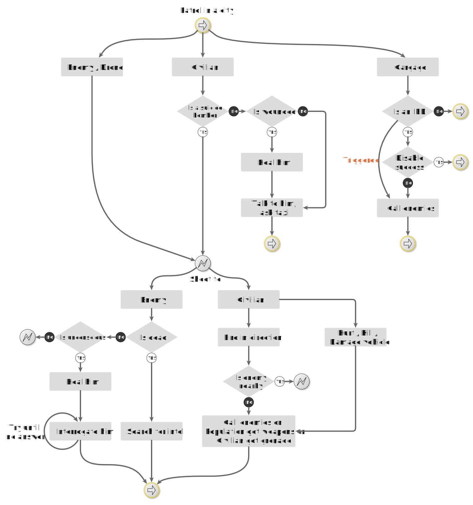

<p align="center">

</p>

# Overview
<p align="justify">

Hearts & Minds+ is a gamemode based on player action where positive actions will result in positive responses from the civilian population. Poor behaviour will result in retaliation. 

The "currency" for population sentiment and actions is visualised through **Reputation.** This was displayed at the top of the client, however a player can now ask a civilian for their reputation level through interaction. Below is the previous location of the repuation system.
</p>

<p align="center">

</p>

## Raise Reputation

High reputation makes travel through liberated easier. It prevents sudden attacks from bi-partisan forces and generally is the aim of H&M+ Here are some activities that raise Reputation.

* [Secure/Liberate Towns](#secure-towns-and-cities)
* [Clear IEDs](#clear-ieds)
* [Remove Graffiti](#remove-graffiti)
* [Complete side missions](#remove-graffiti)

### Secure Towns and Cities

<p align="justify">
The gamemode is primarily focused on clearing enemy presence from each diamond-shaped marker. Whether that marker be a town, city, or elevated position. These are known as "Points". Each point taken from the OPFOR will grow reputation.

Caution, OPFOR partols can retake towns within your "blue zone". Some enemy units will penetrate deep within your zone and take townships that are rarely patrolled. This means that focused partolling is a must. 
</p>

### Clear IEDs

<p align="justify">
IEDs will spawn into freshly taken objectives and can quickly turn a reorg into a MAS-CAS. Improvised explosives can be anything out of the ordinary. For example:

* a car wreck
* a gas cannister
* a mortar bomb

could be an IED and will explode when a player walks into it's proximity.

An IED can be defused using a pair of pliers. This will give a repuation reward.
</p>

### Remove Graffiti

Tags will occasionally appear on roads and buildings. Use the spray can to remove them. To remove Grafiti a player will need:

1. a spray can.
2. to self-interact/tag/remove tag
3. to remove all of the graffiti.

Once the player has removed the tag, a reputation bonus will be granted.

### Complete side Missions

Side missions are displayed on the map as a dark icon depiction the mission type. These are randomly generated scenarios that can be completed for a larger repuation reward. A side mission can be, but not linited to:

* civilian assistance missions
* delivering supplies
* assassinate commander ops
* decontaminate supplies
* destroy a hideout
* clear rubbush

Some side missions will cause a temporary increase in enemy forces within the area so all operations involving seemingly low-risk activities should be treated as dangerous.

## Lower Reputation

Poor behaviour from players will see a reduction of Reputaion. This means that squads will need to know and understand their rules of engagement. While the gameplay is leniant, there are game mechanics that punish violent behaviour toward civilians and civilian infrastructure. Here are a list of some of the actions that will reduce reputation:

* Destroy a civilian building
* Damage a civilian building
* Kill a civilian
* kill an animal

*NOTE:* These are just some of the settings that can change reputation. For a full list of reputation settings, see [full reputation variables](#full-reputation-variables)


# Interaction flow chart

This is a flow chart that outlines the interaction response for Hearts and Minds Plus population AI. 



## Full reputation variables

```s
 # found in HeartsAndMindsPlus/HeartsAndMindsPlusAltis/core/def/mission.sqf
 # line 855

    btc_rep_bonus_cache = 30; 
    btc_rep_bonus_civ_hh = 0;  // HEAL
    btc_rep_bonus_disarm = 20;
    btc_rep_bonus_hideout = 50; 
    btc_rep_bonus_mil_killed = 0; 
    btc_rep_bonus_IEDCleanUp = 10; //REMOVE RUBISH
    btc_rep_bonus_removeTag = 5; 
    btc_rep_bonus_removeTagLetter = 2;
    btc_rep_bonus_foodGive = 5; 
    btc_rep_bonus_vehicle = 0;  // KILL VEHICLE

    btc_rep_malus_veh_killed = 0; // FRIENDLY VEH KILLED
    btc_rep_malus_civ_hd = 0 ; // CIV HIT
    btc_rep_malus_animal_hd = 0 ;  // ANIMAL HIT
    btc_rep_malus_civ_killed = - 50 ; 
    btc_rep_malus_animal_killed = - 10;
    btc_rep_malus_civ_suppressed = 0 ;
    btc_rep_malus_player_respawn = - 3; 
    btc_rep_malus_building_damaged = - 5;
    btc_rep_malus_building_destroyed = - 30;
    btc_rep_malus_foodRemove = - btc_rep_bonus_foodGive;
    btc_rep_malus_breakDoor = - 0.5;
    btc_rep_malus_wheelChange = 0;
    btc_rep_malus_mil_killed = - 5;
```